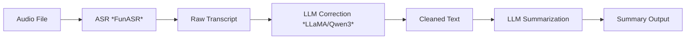

# VoiceLint

**VoiceLint** is a fast, local-first C++ application that transforms raw speech into clean, structured text — including grammar correction and summarization — using offline ASR and lightweight large language models. It features an intuitive **ImGui-based user interface** for real-time interaction and review.

---

## 🧠 What Does It Do?

VoiceLint provides a full offline pipeline for processing spoken language:

1. **ASR Transcription**  
   Transcribe audio using [FunASR](https://github.com/alibaba-damo-academy/FunASR).

2. **Text Correction**  
   Fix recognition errors, restore punctuation, and clean up grammar using local LLMs (LLaMA/Qwen3 via [llama.cpp](https://github.com/ggml-org/llama.cpp)).

3. **Summarization**  
   Generate clear summaries — paragraph-style or bullet points — from corrected text.

4. **GUI Interface**  
   Built with [Dear ImGui](https://github.com/ocornut/imgui) for easy, cross-platform visual interaction.

---

## 🧩 Technology Stack

| Component     | Description                                      |
|---------------|--------------------------------------------------|
| **Language**  | C++17 / C++20                                    |
| **ASR**       | [FunASR](https://github.com/alibaba-damo-academy/FunASR) — fast offline transcription |
| **LLMs**      | [llama.cpp](https://github.com/ggerganov/llama.cpp), [Qwen3](https://huggingface.co/Qwen) — local LLM inference |
| **UI**        | [Dear ImGui](https://github.com/ocornut/imgui) — minimal, cross-platform GUI |
| **Build**     | CMake, fully portable                            |

---

## 💻 Screenshot

---

## 🚀 How It Works

---

## 🔧 Build Instructions
git clone https://github.com/szsteven008/VoiceLint.git
cd VoiceLint
cmake -B build
cmake --build build --config release -j 8

---

## 🛠️ Run VoiceLint
build/bin/voicelint -c config/config.json

---

## 📄 License
MIT License.

---

## ❤️ Credits
	• FunASR by DAMO Academy
	• llama.cpp by Georgi Gerganov
	• Qwen3 by Alibaba Group
	• Dear ImGui by Omar Cornut
